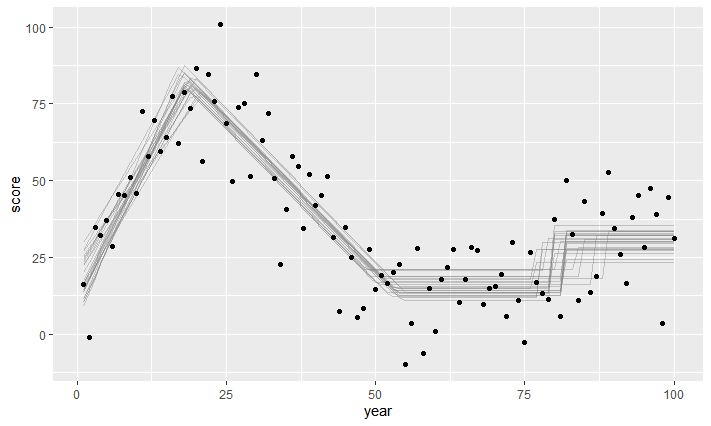
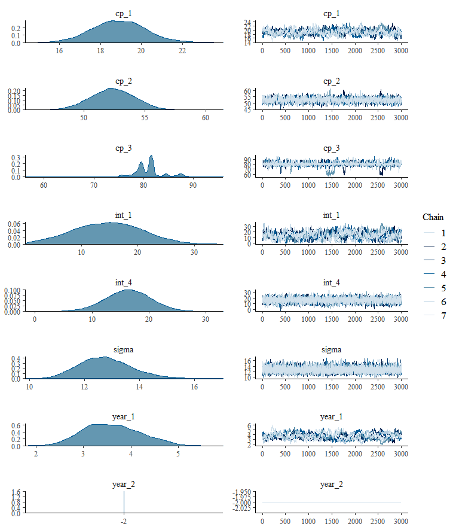

Bayesian inference of multiple change points and the parameters of the (linear) segments in between. Under the hood, `mcp` takes an abstract representation of linear segments, turn it into JAGS code. The rest of the package ensures seamless compatibility with your favourite Bayesian packages, including `tidybayes`, `bayesplot`, and `loo`.

This package is currently in alpha, so expect changes in the API. Also be aware that it has not been thoroughly tested. I would be very excited about any feedback, positive or negative or constructive. Please raise issues or contact me otherwise.


# Install

 * Install JAGS 4.4 or later [from here](https://sourceforge.net/projects/mcmc-jags/files/JAGS/4.x/). Linux users will need to [go here](http://mcmc-jags.sourceforge.net/).
 
 * Run this in R: `devtools::install_github("lindeloev/mcp")`


# Quick usage guide

Find the single change point between two joined slopes:
```
# Define segments
segments = list(
    y ~ 1 + x,  # intercept + slope
    1 ~ 0 + x  # joined slope
)

# Start sampling
fit = mcp(my_data, segments)

# Plot fit
plot(fit)
```

# Extended usage guide

Let us specify a fairly complicated model with four segments, i.e., three change points:
```r
# Define the segments that are separated by change points
segments = list(
  score ~ 1 + year,  # intercept + slope
  1 ~ 0 + year,  # joined slope
  1 ~ 0,  # joined plateau
  1 ~ 1  # disjoined plateau
)
```

Now generate some data from this model, to see if we can recover the parameters:

```r
library(tidyverse)
Dv = list(cp_0 = -Inf, cp_1 = 20, cp_2 = 55, cp_3 = 80,  # Change points
          int_1 = 20, int_4 = 20,  # Intercepts
          year_1 = 3,  year_2 = -2,  # Slopes
          sigma=12)  # standard deviation of residuals

data = tibble(year = seq(1, 100, by=1)) %>%  # Our x-axis
  rowwise() %>%
  mutate(
    score = (year > Dv$cp_0) * (Dv$int_1 + min(year, Dv$cp_1) * Dv$year_1) +  # Segment 1
      (year > Dv$cp_1) * (Dv$year_2 * (min(year, Dv$cp_2) - Dv$cp_1)) +  # Segment 2
      0 +   # Segment 3
      (year > Dv$cp_3) * Dv$int_4,  # Segment 4
    score = rnorm(n(), score, Dv$sigma)  # Add noise
  )
```


Quite uninformative priors are set using data by default. We can override some or all of these by providing JAGS code. This model has the following parameters:

 * `cp_1`, `cp_2`, and `cp_3`: change points on the x-axis (here `year`). One between each adjacent segment.
 * `int_1` and `int_4`: intercept *changes* on y (here `score`). Only specified in the first and the last segment.
 * `year_1`, `year_2`: slopes in segments 1 and 2. Takes name after the x-axis predictor.
 * `sigma`: standard deviation of residuals.

```r
prior = list(
  int_1 = "dunif(10, 30)",  # intercept of segment 1
  cp_2 = "dunif(cp_1, 40)",  # change point between segment 1 and 2. Must be greater than cp_1. Order restriction is applied automatically for everything but dunif (a JAGS limitation).
  year_2 = "dnorm(0, 1/5^2)"  # slope of segment 1. Mean = 0, SD = 5.
)
```

So let's start sampling:
```r
fit = mcp(data, segments, prior)
```


`fit` is now an `mcpfit` object which holds a wealth of information. But first, let us inspect it visually using `plot.mcpfit`:

```r
plot(fit)
```



By default this draws lines given 50 samples. We can see the segments we identified in our model. Notice how similar they are (an index of certainty) and how well they fit to the data (an index of validity).


```r
plot(fit, "combo")
```



This is a classical Bayesian plot to better see parameter estimates and to check convergence between chains. Compare the inferred values to the one we used to generate the data. Change point models do a remarkably good job of recovering the change points on other parameters, including sigma.

Now it's time for some model comparison. We will compare to an intercept-only model with default priors. This one has no change points because there is only one segment, i.e., it is a classical linear regression model. Because the x-axis cannot be read out from the segments when there are no slopes, we need to give it explicitly:

```r
segments2 = list(score ~ 1)
fit2 = mcp(data, segments2, param_x = "year")
```

We can use the cross-validation from the `loo` package to compare the predictive performance of various models. We compute loo for each model and then compare them. the `mcpfit` objects have placeholders for `loo` and `waic` fits. You need not use them, but it's nice to keep things together:

```r
library("loo")
fit$loo = loo(fit)
fit2$loo = loo(fit2)
loo_compare(fit$loo, fit2$loo)
```

Result:
```
       elpd_diff se_diff
model1   0.0       0.0  
model2 -76.1       8.0  
```

Aha, the first model in `loo_compare` (`fit`) was preferred (higher Estimated Log-Predictive Density). The important thing here is the `elpd_diff`/`se_diff` ratio. This is almost like a z-score, i.e., a ratio of 1.96 corresponds to 95% probability that `fit` has superior predictive accuracy. BUT, the `loo` developers have adviced that it is probably too optimistic in practice, so that one should only begin taking it seriously if this ratio exceeds 5 [Citation needed].


The `mcpfit` object holds other useful information:
```r
# Show all priors (not just those specified manually)
fit$prior

# Show JAGS model
cat(fit$model_jags)
```

And you can work with the MCMC samples just as you would with `brms`, `stan_glm`, `jags`, or other samplers using the always excellent `tidybayes`:

```
fit$pars$model  # check out which parameters are inferred.

library(tidybayes)
spread_draws(fit$samples, cp_1, cp_2, int_1, year_1, year_2) %>%
 # tidybayes stuff here
```


# Plans for the immediate future

This is basically just two-three days work. I plan to:

 * Include random effects. For example, if we want to let a change point vary between participants, we could do `segments = list(score ~ 1 + year, (1|id) ~ 0 + year)`
 
 * A proper `summary` method
 
 * Better and more efficient plotting functions.
 
 * Make it work for other likelihoods: binomial (and thereby Bernoulli), Cauchy, etc. I have a hard-coded model working with binomial so it is very doable.
 
 * Specify parameters as *relative* or *absolute*. E.g. relative parameters represent *changes* from the former segment: `rel(1) ~ rel(1) + rel(x)`. I imagine that absolute parameters will be the standard if `rel` is not used. Intercepts are currently relative while slopes are absolute. This will be useful for interpretability and for setting priors when *changes* are more meaningful.
